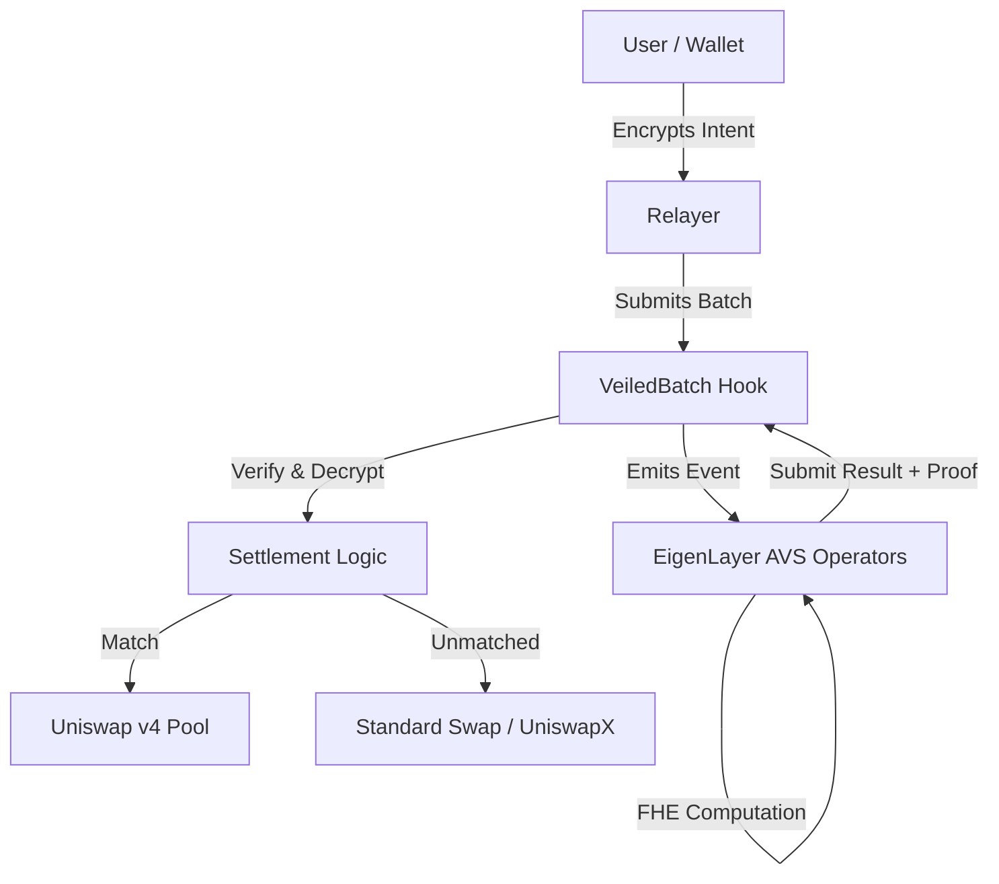

# VeiledBatch Hook 🦄🔒

> **"The CoW Swap you can’t front-run — fully encrypted, restaked batch auctions on Uniswap v4"**


## 📖 Vision

**VeiledBatch** is a Uniswap v4 hook that enables **confidential intent-based batch auctions**. It allows traders to submit fully encrypted intents (size, direction, max slippage) which remain hidden from the public mempool, preventing toxic MEV and sandwich attacks.

Every ~15–30 seconds, these intents are batched and sent to a custom **EigenLayer AVS** that runs a uniform-price auction entirely under **FHE (Fully Homomorphic Encryption)** using **Fhenix**. Only the final matched trades are selectively decrypted and settled on-chain. Unfilled volume automatically falls back to UniswapX or standard v4 pools.

The result: **Zero toxic MEV, full order privacy, and verifiable fair execution.**

---

## 🤝 Partner Integrations

This project leverages cutting-edge infrastructure from the following partners:

### 🟣 Fhenix (FHE)

We utilize **Fhenix** to bring Fully Homomorphic Encryption to the EVM.

- **Usage:** All user intents (amount, direction, slippage) are encrypted using the Fhenix JS SDK before submission.
- **On-Chain:** The `VeiledBatchHook.sol` stores these `euint` (encrypted uint) values.
- **Decryption:** Selective decryption is performed only after the AVS has computed the optimal batch clearing price and matches.
- **Location:** `src/VeiledBatchHook.sol`, `src/avs/VeiledBatchAVSOperator.sol`

### 🌐 EigenLayer (AVS)

We deploy a custom **Actively Validated Service (AVS)** on EigenLayer to handle the heavy lifting of batch matching off-chain but trustlessly.

- **Usage:** Operators stake ETH to register for the VeiledBatch AVS. They listen for finalized batches from the hook.
- **Computation:** Operators perform the batch auction logic (matching orders, calculating clearing price) on the encrypted data.
- **Verification:** Results are signed and verified on-chain before settlement.
- **Location:** `src/avs/VeiledBatchAVS.sol`, `src/avs/VeiledBatchAVSOperator.sol`

---

## ✨ Key Features

- **🔒 True FHE Privacy:** Orders are encrypted from wallet to settlement. No one, not even the solvers, can see your exact trade details until the batch is closed.
- **🛡️ Zero MEV Exposure:** Since intents are hidden, sandwich bots cannot front-run your trades.
- **🤖 Automatic Batching:** Intents are collected and batched automatically based on time (30s) or size (100 intents).
- **🔄 Hybrid Execution:**
  - **Primary:** Encrypted Batch Auction (Uniform Clearing Price).
  - **Fallback:** Unmatched intents are automatically routed to Uniswap v4 pools or UniswapX fillers.
- **🔐 Restaked Security:** Leveraging EigenLayer's pooled security for the off-chain matching engine.

---

## 🏗️ Architecture



### Detailed Flow

1.  **Submission:** User encrypts intent (amount, direction, slippage) via Fhenix SDK and submits to the hook via `beforeSwap`.
2.  **Batching:** The hook collects encrypted intents. Once the batch is full or times out, it emits a `BatchFinalized` event.
3.  **Execution (AVS):** EigenLayer operators pick up the batch, perform the auction matching algorithm on encrypted data, and calculate the clearing price.
4.  **Verification:** Operators submit the result and a signature to the hook. The hook verifies the quorum.
5.  **Settlement:** The hook selectively decrypts the matched amounts and executes the swaps against the Uniswap v4 pool manager.
6.  **Fallback:** Any unmatched volume is executed as a standard swap ensuring no user is left behind.

---

## 📂 Repository Structure

```
VeiledBatch/
├── src/
│   ├── BatchAuctionHook.sol       # Core Hook Logic (Week 1-2)
│   ├── VeiledBatchHook.sol        # Production Hook with FHE (Week 3)
│   ├── IntentBridge.sol           # Intent Management
│   ├── avs/
│   │   ├── VeiledBatchAVS.sol         # EigenLayer Service Manager
│   │   ├── VeiledBatchAVSOperator.sol # Operator Logic
│   │   └── interfaces/                # Interfaces
│   └── mocks/
│       └── MockAVS.sol            # Simulation for local testing
├── script/
│   ├── Deploy.s.sol               # Deployment Scripts
│   └── DeployProduction.s.sol     # Fhenix Deployment
├── test/
│   └── BatchAuction.t.sol         # Foundry Tests
└── docs/                          # Documentation & Assets
```

---

## 🚀 Getting Started

### Prerequisites

- [Foundry](https://book.getfoundry.sh/getting-started/installation)
- [Node.js](https://nodejs.org/) (for frontend/SDK)

### Installation

```bash
git clone https://github.com/your-username/VeiledBatch.git
cd VeiledBatch
forge install
```

### Build

```bash
# Build contracts (via-ir enabled for stack optimization)
forge build
```

### Test

```bash
# Run all tests
forge test

# Run with verbosity for debugging
forge test -vv
```

_Note: Local tests use `MockAVS.sol` to simulate the FHE and AVS layers. For full FHE functionality, deployment to Fhenix testnet is required._

---

## ✅ Implementation Status

| Feature             | Status | Description                                                    |
| :------------------ | :----: | :------------------------------------------------------------- |
| **Hook Core**       |   ✅   | Intent storage, batch management, event emission               |
| **Settlement**      |   ✅   | Clearing price logic, swap execution, fallback mechanism       |
| **FHE Integration** |   ✅   | `euint` types, encrypted submission, permissioned decryption   |
| **AVS Integration** |   ✅   | Operator registration, task submission, signature verification |
| **Frontend**        |   🚧   | React UI for encrypted intent submission (In Progress)         |
| **Deployment**      |   🔄   | Ready for Fhenix Helium Testnet                                |

---

## 🏆 Hackathon Tracks

- **Uniswap Hook Incubator (UHI):** Innovative use of v4 hooks to solve MEV.
- **Fhenix:** Core privacy architecture using FHE.
- **EigenLayer:** Decentralized off-chain computation for batch matching.

---

## 📄 License

MIT
